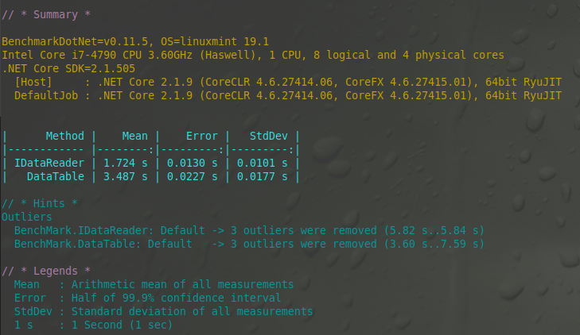

Questo progetto è inteso come esempio e studio per controllare e manipolare una lista di oggetti generici all'interno di un IDataReader

Scopo principale di questo studio è la possibilità di utilizzare questo oggetto all'interno di un oggetto **SqlBulkCopy**

Di seguito un screen dei benchmark eseguiti sulla SqlBulkCopy tra creare una DataTable ed utilizzare l'implementazione di IDataReader

